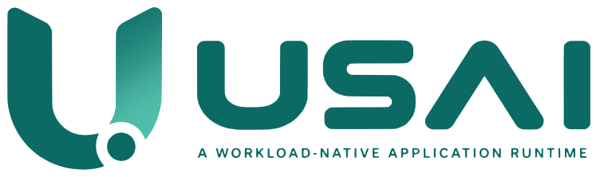

<p align="center">
  <picture>
    <source media="(prefers-color-scheme: dark)" srcset="docs/brand/usai-logo-on-dark.svg">
    
  </picture>
</p>

> **A program should live only as long as its work requires.**

Usai is a workload-native application runtime that keeps expensive runtime
infrastructure alive while making application execution ephemeral by default.

Usai is an independent open-source project in the Sakala ecosystem. It is
designed to remain useful on its own: applications must be able to develop,
build, and run on Usai without requiring Sakala or another deployment platform.

## Status

**Alpha (0.0.x) — production qualification in progress.** Everything that
exists has acceptance tests and ships from one tag (binaries, npm, Docker);
a production-shaped deployment has been broken eleven ways under load (P5)
and campaigned for reliability (P6), **soaked for 72 hours (73.6 M requests,
no 5xx, no runtime error, flat memory)**, and run as two replicas behind one
proxy — with the findings fixed. Still open: developers outside the project
building from the docs alone (`docs/P7-EXTERNAL-VALIDATION.md`) and frozen
contracts. `docs/STATUS.md` ("Production readiness") says exactly where each
gate stands, and `docs/ROADMAP.md` how they close. Use it for development,
evaluation and internal tools you can restart; put it in front of paying
traffic knowing those two caveats.

**What it costs and what it buys**, measured against six comparators on one
box (`docs/measurements/2026-09-23-sweep.md`): a request that touches
PostgreSQL — what an application is made of — runs level with a single Node
process and ahead of it on transactions, ahead of a tuned PHP-FPM, and
1.8–7× ahead of Laravel. A request that does nothing costs **6–14× Node's
CPU**, because every unit of work gets a fresh execution world: ask each
server for a module-level counter ten times and Usai answers `1 1 1 1 1 1 1
1 1 1` where one Node process answers `1 2 3 …` and an eight-worker cluster
answers `1 1 1 1 1 1 1 1 2 2`. Choose it for that property, not for
hello-world throughput.

The research phase established enough evidence to justify building a real
runtime. This repository is the clean production-oriented implementation.

The model was validated first in a separate research programme (a private
repository, maintainers only). This production repository inherits its
proven contracts and lessons — recorded here as `docs/LIFECYCLE-CONTRACTS.md`,
the ADRs and `docs/measurements/` — not its experiment-oriented code or
structure, and has no dependency on it (ADR-0001).

## Why Usai?

Most backend runtimes naturally keep the application process and its mutable
application world alive for a long time:

```text
start
→ bootstrap
→ request
→ request
→ request
→ ...
```

That model is correct for many workloads. Usai explores a different default:

```text
persistent runtime
        +
immutable application definition
        +
fresh execution world per unit of work
```

The important distinction is not "persistent versus ephemeral".

It is:

> **What is the natural lifetime of each piece of state and each resource?**

A database connection may deserve to outlive a request.

Mutable request state usually does not.

An immutable application definition may serve thousands of executions.

An external operation may outlive the execution world that started it.

Usai makes those lifetime boundaries explicit.

## Core model

Usai separates three primary layers.

### Persistent Runtime State

Long-lived infrastructure that is expensive or nonsensical to recreate for
every request:

- HTTP/network listeners
- scheduler/runtime infrastructure
- engine and allocation infrastructure
- observability
- connection/resource managers
- runtime-owned capabilities

### Immutable Application Definition

Reusable application state that belongs to a deployment or revision:

- compiled/bundled code
- routes
- schemas and metadata
- configuration metadata
- dependency metadata
- preinitialized application representation

### Ephemeral Execution World

Mutable state whose natural lifetime is one unit of work:

- request state
- auth/user/tenant context
- mutable application globals
- temporary objects
- request-scoped dependencies
- resource leases

When the work is complete, the world ends.

The runtime does not.

## Lifetime principles

Usai is built around a few rules:

> **Persistent runtime does not imply persistent application state.**

> **Ephemeral by default; persistent by intent.**

> **Nothing should share a lifetime merely because it shares a process.**

> **Death is not cleanup. Ownership is cleanup.**

Destroying an execution world does not automatically mean an external
operation has terminated or that a resource is safe to reuse. Resource reuse
requires explicit ownership and terminal-state rules.

## Try it

As a user (binary from the [releases](https://github.com/gmedia/usai/releases), packages from npm):

```bash
pnpm dlx @sakaladev/create-usai my-app && cd my-app && pnpm install
pnpm dev                                                  # http://127.0.0.1:3000/hello/world (fetches the usai binary once)
docker compose up                                         # the same, with nothing installed (sakaladev/usai:<v>-dev)
docker build -t my-app . && docker run -p 3000:3000 my-app   # runtime image + artifact, non-root, no toolchain
```

From this repository:

```bash
pnpm install
cargo run -p usai-cli -- dev --root examples/hello       # build, serve on :3000, rebuild on change
curl http://localhost:3000/hello/world
cargo run -p usai-cli -- --root examples/hello test      # tests through the real runtime (usai/test)
cargo run -p usai-cli -- --root examples/hello inspect   # what the runtime understood
```

A realistic application — modules, migrations, seeders, a dispatched task,
a cron, a command, and tests — is `examples/todos`; `docs/GUIDE.md` §16
walks through it.

What exists today (each with acceptance tests): contract-aware HTTP with
validation before a world exists, tasks with explicit ownership transfer,
cron, commands, PostgreSQL with terminal-proof connection reuse, migrations
and seeders, a PostgreSQL-backed queue with explicit retry, streams,
WebSockets, services with restart policy, OpenAPI from the definition,
`/_usai/status` + `/_usai/metrics`, a graph, an orchestrator control
surface, and a `usai/test` harness. See `docs/GUIDE.md` and `docs/STATUS.md`.

`examples/hello/src/app.ts`:

```ts
import { defineApp, http, errors } from "@sakaladev/usai";
import { z } from "zod";

const Params = z.object({ name: z.string().min(1).max(40) });
const Greeting = z.object({ hello: z.string() });

export const hello = http.get("/hello/:name", { params: Params, response: Greeting }, async (ctx) => {
  if (ctx.params.name === "nobody") throw errors.notFound("nobody is not here");
  return { hello: ctx.params.name };
});

export default defineApp({ name: "hello", workloads: [hello] });
```

Each request runs in a fresh execution world; invalid params are rejected
before a world exists; `usai inspect` shows exactly what the runtime
understood. `docs/STATUS.md` says what is implemented, what is measured,
and what is not.

Three references, one per question:

| Question | Where |
|---|---|
| How do I build with this? | [`docs/GUIDE.md`](docs/GUIDE.md) — every workload kind (HTTP, tasks, cron, commands, PostgreSQL, queue, streams, WebSockets, services), configuration, operations, testing |
| What does `http.get` / `ctx.tasks.dispatch` / `postgres` take and promise? | [`docs/sdk/`](docs/sdk/README.md) — the SDK reference, generated from the source's doc comments |
| What is *my* application and what happens when a request enters it? | `/_usai/docs` on a running application — the application reference, generated from the definition the runtime executes; `/_usai/openapi.json?profile=public` and `usai generate openapi --public` for the consumer contract |
| How do I deploy and run it? | [`docs/deploy/compose.production.yaml`](docs/deploy/compose.production.yaml) (Docker), [`docs/runbooks/systemd.md`](docs/runbooks/systemd.md) (a plain VM), [`docs/deploy/k8s/`](docs/deploy/k8s/README.md) (Kubernetes) — and [`docs/runbooks/`](docs/runbooks/README.md) for what to do when something goes wrong, one page per incident |

The developer surface is TypeScript; contracts may still change within
`0.0.x` (`CHANGELOG.md` says what, `SUPPORTED.md` how upgrades work).

## Current implementation direction

The production implementation starts from the architecture that survived the
research program:

```text
Developer surface     TypeScript
Host runtime          Rust
Application build     TypeScript → bundled application artifact
Runtime infrastructure persistent
Application state     ephemeral by default
Persistent state      explicit
```

The exact JavaScript/Wasm engine representation is an implementation decision,
not part of the public philosophy. It may change if a better representation
preserves the same semantics and improves the total system.

## Research foundation

The research programme tested the runtime model through disposable-world
semantics, asynchronous suspension, cancellation and reclamation, persistent
PostgreSQL capabilities, real HTTP composition, simultaneous execution worlds,
and concurrency economics.

The latest sealed research checkpoint is **EXP-012B**.

The important production lesson is not a benchmark slogan. It is that
ephemeral execution can remain economically viable when the implementation
does not pay work that the semantics never required.

Research evidence must not be rewritten as marketing claims. Production
readiness, multi-core scaling, long-duration reliability, security boundaries,
many-application density, ecosystem compatibility, and operational behavior
remain engineering and validation work.

## Scope

The first production track focuses on ordinary backend workloads:

- REST APIs
- CRUD/business backends
- webhooks
- internal applications
- small and medium services
- bursty or highly idle services
- eventually, shared multi-application runtimes

This is a proving ground, not a permanent product-size restriction.

Naturally persistent workloads such as long-lived socket servers, queue
consumers, brokers, databases, proxies, or inference servers should not be
forced into request-shaped lifetimes.

## Non-goals for the initial runtime

Usai is not currently trying to build:

- a new programming language
- a full Node.js compatibility layer
- an ORM
- a distributed scheduler
- a multi-region platform
- a custom JavaScript engine
- a package registry
- a plugin marketplace
- a deployment platform

Those may become relevant someday, but none are prerequisites for proving that
the runtime itself is useful.

## Sakala ecosystem

Usai is an independent project in the Sakala open-source ecosystem, maintained
by the Sakala maintainers (`GOVERNANCE.md`); the repository is hosted in the
gmedia organization, which supports the project without steering it.

Sakala may become a first-class deployment integration for Usai, but Usai must
remain usable independently and must not require Sakala at runtime or during
local development.

The two projects may integrate deeply without sharing a forced technical
lifetime.

## Development philosophy

This repository is now normal software engineering.

Use:

```text
design
→ implement
→ test
→ benchmark
→ profile
→ improve
→ regression test
→ release
```

Formal research experiments are reserved for decision-critical questions that
ordinary implementation, testing, profiling, or benchmarking cannot answer
reliably.

The goal is no longer to reproduce the research harness.

The goal is to turn the evidence into a runtime developers can actually use.

## License

Licensed under the Apache License, Version 2.0. See [LICENSE](LICENSE).
